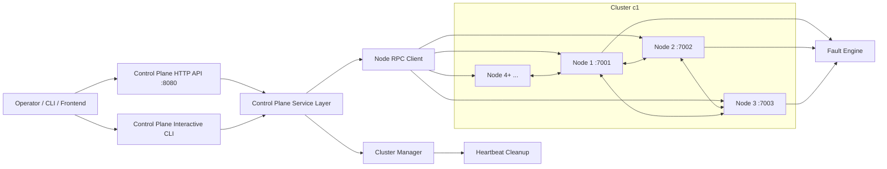

# faultlab

Faultlab is a distributed systems fault-injection lab with a control plane, multiple nodes, and an optional frontend for cluster operations and visualization.

## Architecture Diagram



## Prerequisites

- Go 1.22+ (or project-required version)
- make
- Node.js and npm (only for frontend)

## Run With Makefile

From repository root:

```bash
make controlplane
```

Starts control plane gRPC server on :9000.

In separate terminals, start nodes:

```bash
make node1
make node2
make node3
```

You can run up to node10 with targets node1 ... node10.

Start full cluster (control plane + 10 nodes):

```bash
make cluster
```

Stop all make-based processes:

```bash
make stop
```

Run nodes with runtime config:

```bash
make config-node1 CONFIG_FILE=node.runtime.ini
make config-node2 CONFIG_FILE=node.runtime.ini
```

Run frontend (optional):

```bash
make fe
```

## Run With Direct Commands

### Control Plane

```bash
go run ./cmd/controlplane -port 9000 -http-port 8080 -heartbeat-timeout 5s
```

Flags:

- -port control plane gRPC port (default 9000)
- -http-port control plane HTTP port (default 8080)
- -heartbeat-timeout node heartbeat timeout for cleanup loop (default 5s)

### Node

```bash
go run ./cmd/node \
	-id node1 \
	-port 7001 \
	-cluster-id c1 \
	-host localhost \
	-peers node2:7002,node3:7003
```

Useful node flags:

- -id node ID
- -port node port
- -cluster-id cluster identifier
- -host advertised host/address (default localhost)
- -peers comma-separated peer list in id:port format
- -config path to runtime INI config
- -cp-host override control plane host from config
- -cp-port override control plane gRPC port from config

Node with config file:

```bash
go run ./cmd/node \
	-id node1 \
	-port 7001 \
	-cluster-id c1 \
	-config node.runtime.ini
```

## Control Plane CLI Commands

While control plane is running, enter commands in its terminal:

- new-cluster <cluster-id> [protocol]
- add-node <cluster-id> <node-id> <host> <port>
- remove-node <cluster-id> <node-id>
- list-nodes <cluster-id>
- list-clusters
- kv-put <cluster-id> <node-id> <key> <value>
- kv-get <cluster-id> <node-id> <key>
- metrics-start <cluster-id> [interval-ms]
- metrics-watch-key <cluster-id> <key>
- metrics-show <cluster-id>
- metrics-stop <cluster-id>
- set-fault <cluster-id> <node-id> <crashed:true|false> <drop-rate:0..1> <delay-ms:int> [partition-csv]
- help

## Typical Local Workflow

1. Start control plane.
2. Start 3 to 10 nodes in separate terminals.
3. Use control plane commands to create cluster and manage nodes.
4. Optionally run frontend.
5. Stop processes with Ctrl+C or make stop.
