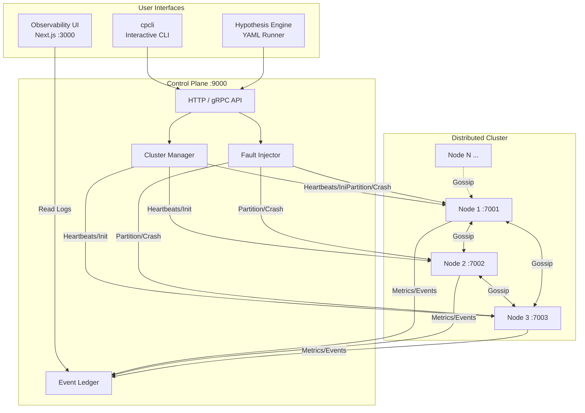

# FaultLab: Distributed Systems Observability Suite

FaultLab is a distributed systems fault-injection lab with a control plane, multiple nodes, and an optional frontend for cluster operations and visualization.

## Demo

Watch the demo video: https://www.youtube.com/watch?v=GlBehFIIKhc

## Architecture & Subsystems


```mermaid
flowchart TB
    subgraph Interfaces ["User Interfaces"]
        FE[Observability UI<br/>Next.js :3000]
        CLI[cpcli<br/>Interactive CLI]
        YAML[Hypothesis Engine<br/>YAML Runner]
    end

    subgraph CP ["Control Plane :9000"]
        API[HTTP / gRPC API]
        Ledger[Event Ledger]
        CM[Cluster Manager]
        Injector[Fault Injector]
    end

    subgraph Cluster ["Distributed Cluster"]
        N1[Node 1 :7001]
        N2[Node 2 :7002]
        N3[Node 3 :7003]
        NX[Node N ...]
        
        N1 <-->|Gossip| N2
        N2 <-->|Gossip| N3
        N3 <-->|Gossip| N1
        NX -.->|Gossip| N1
    end

    FE -->|Read Logs| Ledger
    CLI --> API
    YAML --> API

    API --> CM
    API --> Injector

    CM -->|Heartbeats/Init| N1
    CM -->|Heartbeats/Init| N2
    CM -->|Heartbeats/Init| N3

    Injector -->|Partition/Crash| N1
    Injector -->|Partition/Crash| N2
    Injector -->|Partition/Crash| N3

    N1 -->|Metrics/Events| Ledger
    N2 -->|Metrics/Events| Ledger
    N3 -->|Metrics/Events| Ledger
```

### Subsystems Reference
- **Observability UI (`frontend/`)**: A rich React/Next.js dashboard that reads the execution ledger to generate causal timelines, convergence heatmaps, and dynamic full-mesh topology diagrams.
- **Control Plane (`internal/controlplane/`)**: The central brain that initializes clusters, tracks heartbeats, exposes gRPC/HTTP APIs, and stores the centralized causal event ledger.
- **Database Nodes (`internal/node/`)**: Lightweight, independent processes running an epidemic gossip protocol and CRDT-based Last-Write-Wins (LWW) resolution engine.
- **Hypothesis Engine (`cmd/cpcli/`)**: A dedicated CLI and parsing engine that turns YAML experiment files into exact, deterministic network manipulation commands.

## Detailed Subsystem Documentation
Please refer to our detailed documentation in the `docs/` folder for deeper architectural dives:
- [Architecture Overview](docs/architecture.md)
- [Getting Started / Quick Start](docs/getting-started.md)
- [Hypothesis Engine Guide](docs/hypothesis-engine.md)
- [Subsystem: Logging & Observability](docs/subsystem-logging.md)
- [Subsystem: Control Plane](docs/subsystem-controlplane.md)
- [Subsystem: Database Nodes & Gossip](docs/subsystem-node.md)

---

## Prerequisites

- Go 1.22+ (or project-required version)
- make
- Node.js and npm (only for frontend)

## Run With Makefile

From repository root:

```bash
make controlplane
```

Starts control plane gRPC server on :9000.

In separate terminals, start nodes:

```bash
make node1
make node2
make node3
```

You can run up to node10 with targets node1 ... node10.

Start full cluster (control plane + 10 nodes backgrounded):

```bash
make cluster
```

Stop all make-based processes:

```bash
make stop
```

Run nodes with runtime config:

```bash
make config-node1 CONFIG_FILE=node.runtime.ini
make config-node2 CONFIG_FILE=node.runtime.ini
```

Run frontend (optional):

```bash
make fe
```

## Run With Direct Commands

### Control Plane

```bash
go run ./cmd/controlplane -port 9000 -http-port 8080 -heartbeat-timeout 5s
```

Flags:
- `-port` control plane gRPC port (default 9000)
- `-http-port` control plane HTTP port (default 8080)
- `-heartbeat-timeout` node heartbeat timeout for cleanup loop (default 5s)

### Node

```bash
go run ./cmd/node \
	-id node1 \
	-port 7001 \
	-cluster-id c1 \
	-host localhost \
	-peers node2:7002,node3:7003
```

Useful node flags:
- `-id` node ID
- `-port` node port
- `-cluster-id` cluster identifier
- `-host` advertised host/address (default localhost)
- `-peers` comma-separated peer list in id:port format
- `-config` path to runtime INI config
- `-cp-host` override control plane host from config
- `-cp-port` override control plane gRPC port from config

## Control Plane CLI Commands

While control plane is running, enter commands in its interactive terminal or pass via `make cpcli CMD="..."`:

- `new-cluster <cluster-id> [protocol]`
- `add-node <cluster-id> <node-id> <host> <port>`
- `remove-node <cluster-id> <node-id>`
- `list-nodes <cluster-id>`
- `list-clusters`
- `kv-put <cluster-id> <node-id> <key> <value>`
- `kv-get <cluster-id> <node-id> <key>`
- `metrics-start <cluster-id> [interval-ms]`
- `metrics-watch-key <cluster-id> <key>`
- `metrics-show <cluster-id>`
- `metrics-stop <cluster-id>`
- `set-fault <cluster-id> <node-id> <crashed:true|false> <drop-rate:0..1> <delay-ms:int> [partition-csv]`
- `run-hypothesis <relative-experiment-path>`
- `help`

## Typical Local Workflow

1. Start control plane (`make controlplane`).
2. Start 3 to 10 nodes in separate terminals (`make node1`, etc.) or all at once (`make cluster`).
3. Optionally run frontend (`make fe`).
4. Run a test like `make cpcli CMD="run-hypothesis hypotheses/h6_scalability_convergence.yaml"`.
5. Stop processes with Ctrl+C or `make stop`.
