# FaultLab Architecture Documentation

## Project Overview

**FaultLab** is a distributed systems testing and fault injection framework for:
- **Cluster Management**: Create and organize multiple clusters with pluggable protocols
- **Node Management**: Register, monitor, and control distributed nodes via a central control plane
- **Protocol Testing**: Support for consensus/communication protocol implementations (baseline protocol included)
- **Fault Injection**: Monitor node health, detect failures, and manage cluster state
- **Web Interface**: Next.js dashboard for cluster visualization and management

---

## Logical Architecture Layers

FaultLab is organized into **4 distinct logical layers**:

```
┌─────────────────────────────────────────────────────┐
│ Layer 4: Presentation & Integration                │
│ (CLI, REST API, Web Frontend)                      │
└────────────────┬────────────────────────────────────┘
                 │
┌────────────────▼────────────────────────────────────┐
│ Layer 3: Orchestration & Coordination               │
│ (Control Plane: Actor, Service, Manager)            │
└────────────────┬────────────────────────────────────┘
                 │
┌────────────────▼────────────────────────────────────┐
│ Layer 2: Protocol & Communication                   │
│ (Runtime, Protocol Driver, Protocol Abstraction)    │
└────────────────┬────────────────────────────────────┘
                 │
┌────────────────▼────────────────────────────────────┐
│ Layer 1: Transport & Infrastructure                 │
│ (gRPC, Sessions, Envelope Format)                  │
└─────────────────────────────────────────────────────┘
```

### Layer 1: Transport & Infrastructure
**Location**: `internal/protocol/`, `internal/node/session/`, `internal/transport/`

**Responsibility**: Low-level message transport and session management

**Components**:
- **gRPC Transport**: OrchestratorService (ControlPlane) and NodeService (Node-to-Node)
- **Session Management**: ControlPlaneSession and NodeSession for connection pooling and health tracking
- **Envelope Format**: Protocol-agnostic message wrapper with metadata

**Key Types**:
```go
Envelope {
  From, To: string           // Node identifiers
  Protocol: ProtocolID       // Which protocol this message belongs to
  Payload: []byte            // Serialized protocol-specific data
  Kind: MessageKind          // Protocol/Control/Data
  LogicalTick: uint64        // Protocol logical clock
}
```

---

### Layer 2: Protocol & Communication
**Location**: `internal/node/`, `internal/node/runtime/`, `internal/node/protocol/`

**Responsibility**: Protocol execution, message processing, and distributed algorithm coordination

**Components**:
1. **Protocol Abstraction** - Pluggable interface for consensus algorithms
2. **Protocol Driver** - Manages protocol lifecycle and message routing
3. **Runtime** - Orchestrates protocol driver, event handling, and session initialization
4. **Baseline Protocol** - Reference implementation using gossip-based membership detection

**Key Types**:
```go
ClusterProtocol interface {
  Start(nodeID string) error
  Tick() []Envelope                    // Logical clock advancement
  OnMessage(env Envelope) []Envelope   // Message processing
  Stop() error
  State() any
}

RuntimeEvent = EventTick | EventMessage
```

---

### Layer 3: Orchestration & Coordination
**Location**: `internal/controlplane/`, `internal/cluster/`

**Responsibility**: Centralized cluster state management and node coordination

**Components**:
1. **Actor** - Asynchronous command processor (prevents race conditions)
2. **Service** - Business logic layer for node operations
3. **Manager** - Thread-safe cluster state storage and queries
4. **Heartbeat Manager** - Failure detection and node cleanup

**Key Operations**:
- Node registration with verification
- Heartbeat collection and timeout-based dead node removal
- Peer discovery and list management
- Command sequencing via actor pattern

---

### Layer 4: Presentation & Integration
**Location**: `cmd/controlplane/`, `cmd/node/`, `frontend/`, `internal/controlplane/rest/`

**Responsibility**: External interfaces and user interaction

**Components**:
1. **CLI** - Command-line interface for cluster operations
2. **REST API** - HTTP endpoint for programmatic control (port 8080)
3. **Web Frontend** - Next.js dashboard for visualization

**Supported Commands**:
```
new-cluster <name> <protocol>
add-node <cluster-id> <node-id> <node-address>:<port>
remove-node <cluster-id> <node-id>
list-nodes <cluster-id>
list-clusters
```

---

## System Architecture & Component Interaction

### System Overview Diagram

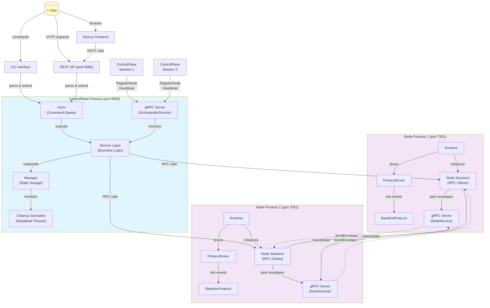

---

## Data Flow: Node Registration & Heartbeat Lifecycle

### Complete Node Registration Flow

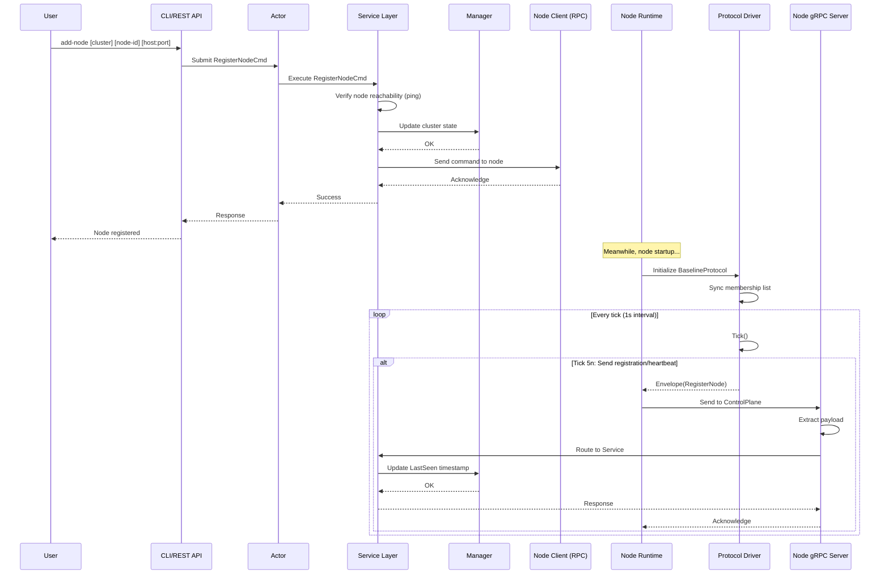

### Failure Detection & Dead Node Removal

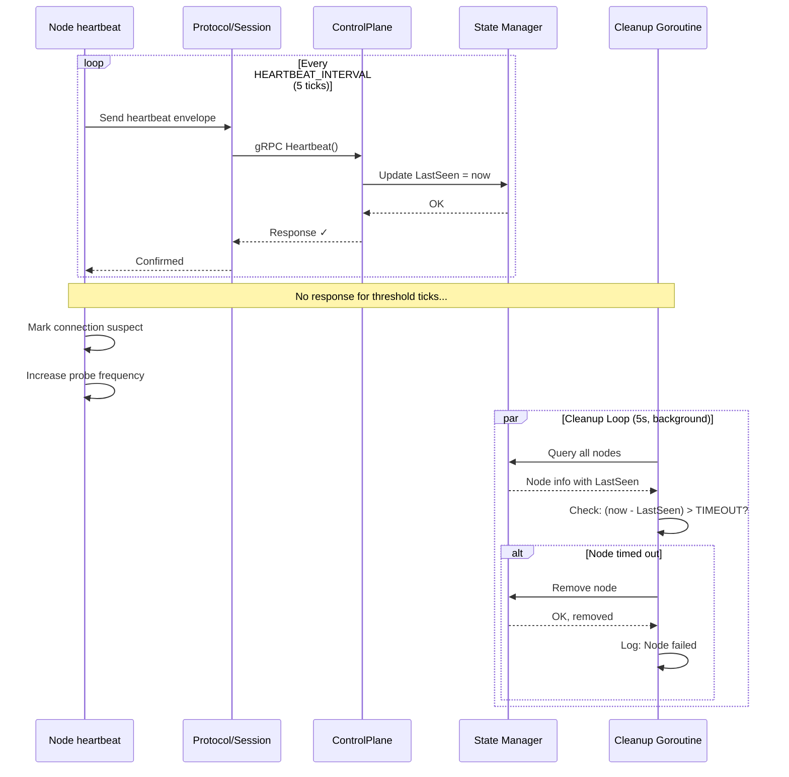

---

## Layer Interaction & Communication Patterns

### Communication Matrix

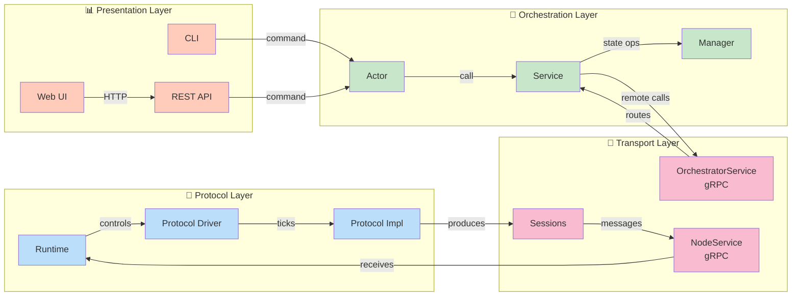

---

## Component Dependency Graph

### Detailed Dependency Tree

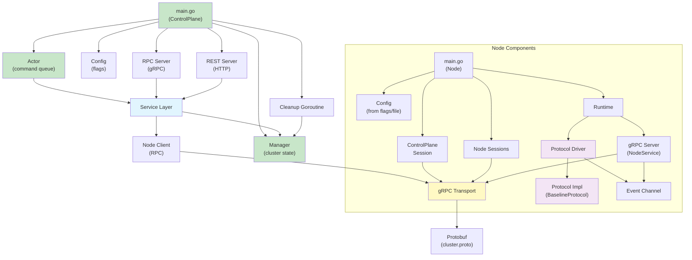

---

## Protocol Execution Model

### BaselineProtocol Lifecycle

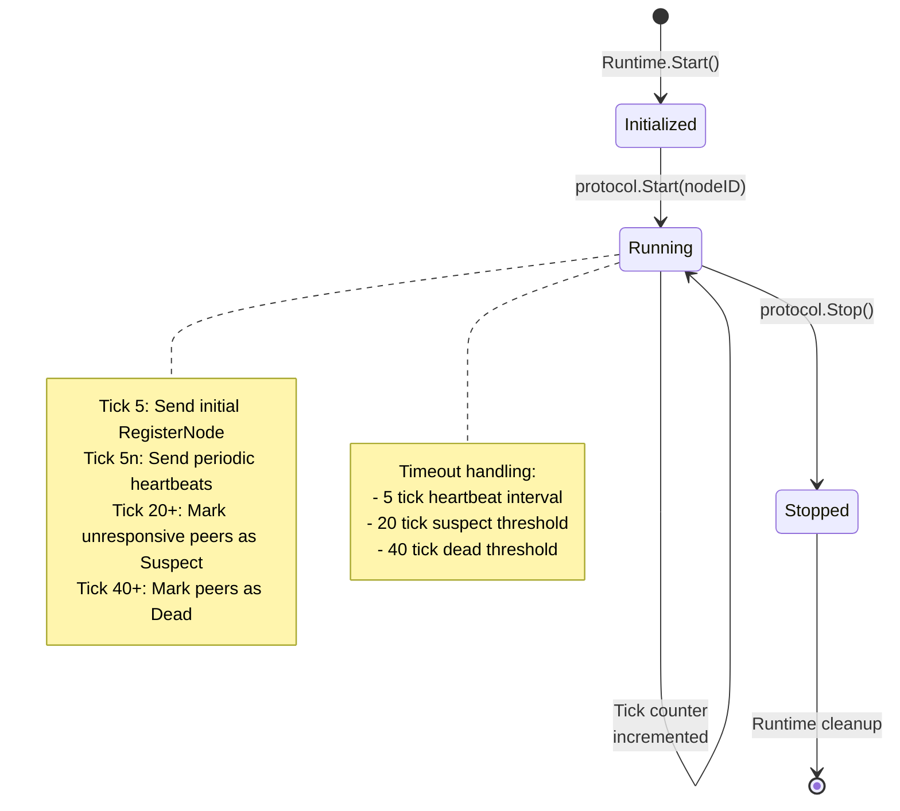

### Message Processing Loop

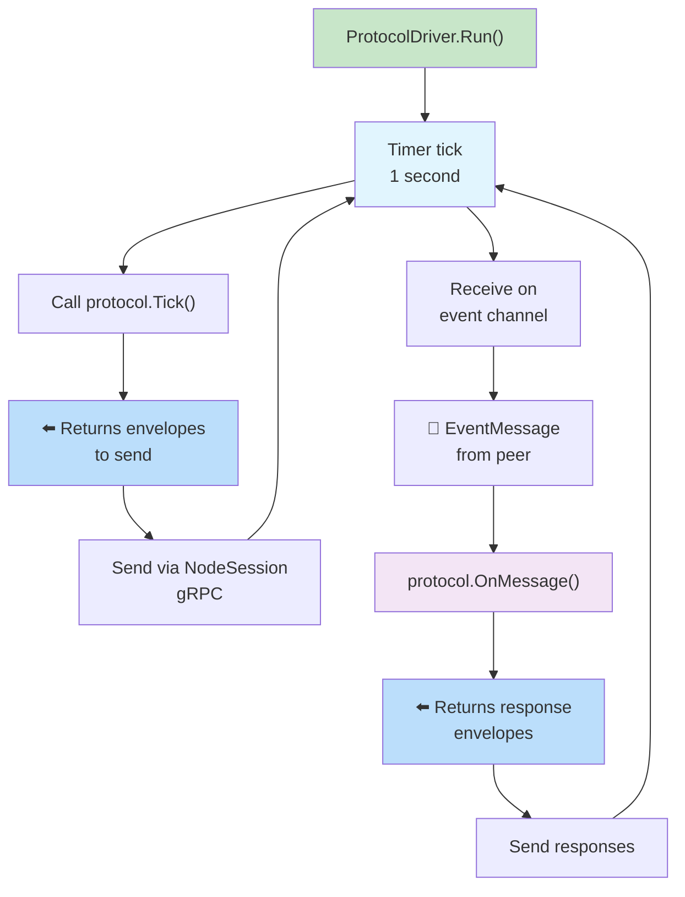

---

## Control Plane Command Processing

### Actor-based Command Execution

```mermaid
graph LR
    subgraph Input["Input Sources"]
        CLI["CLI<br/>new-cluster"]
        REST["REST<br/>add-node"]
    end
    
    Input -->|parse command| Parser["Command Parser"]
    Parser -->|create cmd object| Queue["Actor.cmdCh<br/>(buffered channel)"]
    
    Queue -->|dequeue| ActorRun["Actor.Run()<br/>goroutine"]
    
    ActorRun -->|switch on| Execute["Command Executor"]
    
    Execute -->|RegisterNodeCmd| Service1["Service.RegisterNode()"]
    Execute -->|CreateClusterCmd| Service2["Service.CreateCluster()"]
    Execute -->|RemoveNodeCmd| Service3["Service.RemoveNode()"]
    
    Service1 --> Manager["Manager<br/>(state update)"]
    Service2 --> Manager
    Service3 --> Manager
    
    Manager -->|write| State["Cluster State<br/>(RWMutex protected)"]
    
    State -->|reply via| ReplyCh["Actor.replyCh"]
    ReplyCh -->|return| Output["CLI/REST/gRPC<br/>Response"]
    
    style Queue fill:#fff9c4
    style ActorRun fill:#e1f5fe
    style State fill:#c8e6c9
```

---

## Node Startup & Initialization Sequence

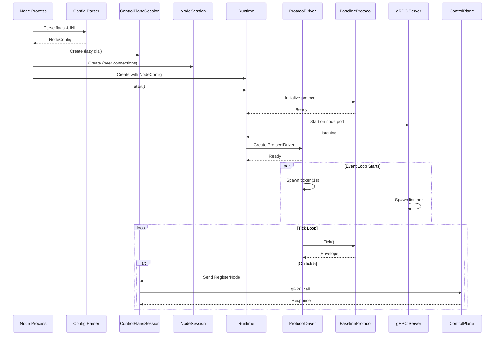

---

## Protocol Extension Points

### How to Add a New Protocol

The architecture is designed for pluggable protocols. To add a new consensus algorithm:

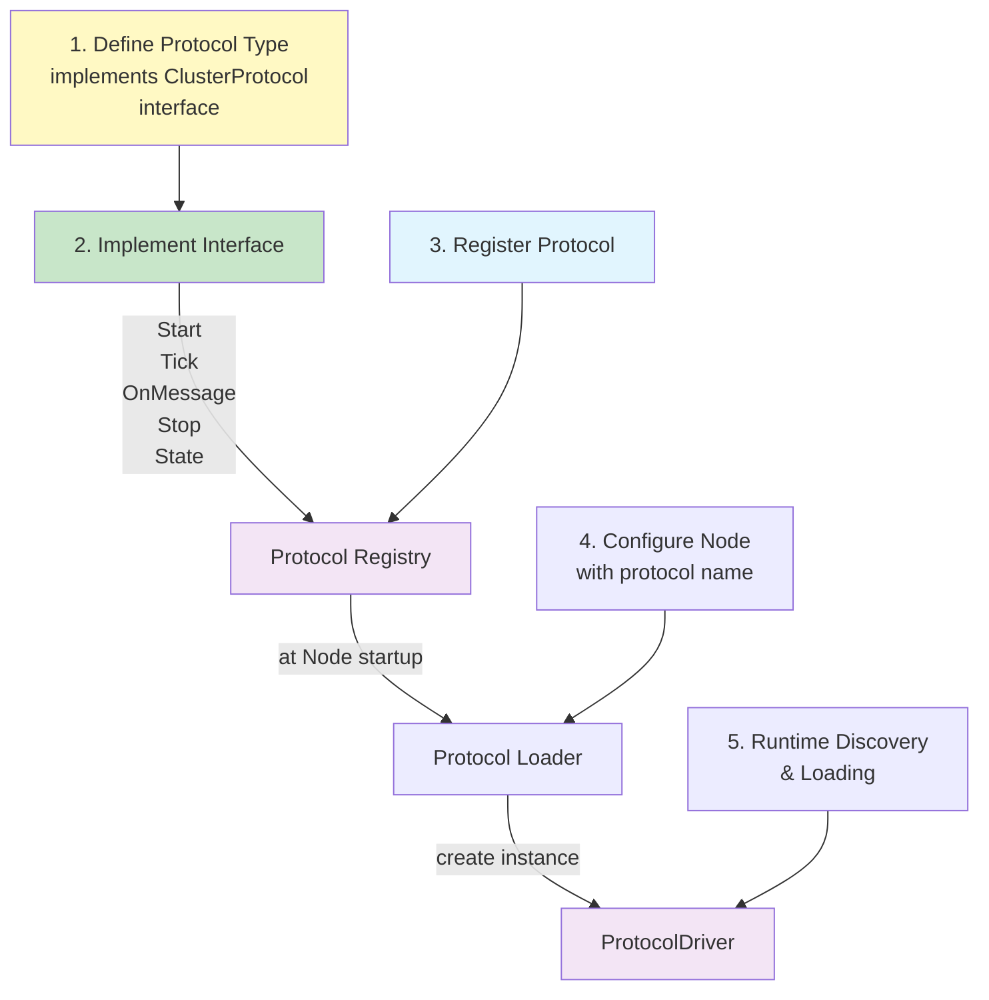

---

## State Management & Thread Safety

### Manager State Protection

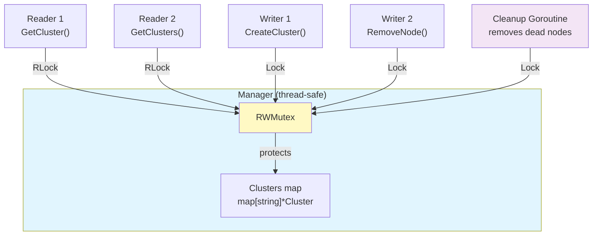

---

## Information Flow Summary

### Upstream (Node → ControlPlane)

1. **Event Generation**: Protocol driver generates message envelopes on ticks
2. **Envelope Delivery**: Via Node gRPC Session to ControlPlane
3. **Service Routing**: ControlPlane RPC server forwards to Service layer
4. **State Update**: Manager updates cluster state atomically
5. **Cleanup**: Background goroutine monitors for timeouts

### Downstream (ControlPlane → Node)

1. **Command Submission**: CLI/REST submit commands to Actor queue
2. **Execution**: Actor dequeues and delegates to Service
3. **Remote Operations**: Service calls Node via NodeClient (gRPC)
4. **Response**: Node gRPC server processes and replies
5. **Local State**: Node protocol processes responses in OnMessage()

### Peer-to-Peer (Node ↔ Node)

1. **Initiation**: Protocol generates peer envelopes on tick
2. **Handshake**: NodeSession initiates lazy connection with Handshake()
3. **Message Delivery**: SendEnvelope() via gRPC
4. **Reception**: Peer gRPC server receives and queues event
5. **Processing**: ProtocolDriver processes in OnMessage()

---

## Key Architectural Decisions

| Decision | Rationale | Impact |
|----------|-----------|--------|
| **Actor Pattern** | Serializes commands, prevents race conditions | Single point of concurrency control |
| **Protocol Interface** | Allows multiple algorithms on same infrastructure | Extensible, pluggable protocols |
| **Envelope Abstraction** | Protocol-agnostic message wrapper | Node-to-node messages are generic |
| **Lazy Connections** | Reduce resource overhead for sparse clusters | Connection on first message |
| **Heartbeat Timeout** | Distributed failure detection | Eventual consistency of state |
| **Logical Ticks** | Deterministic protocol execution | Reproducible behavior for testing |
| **Two-Tier RPC** | Separation of concerns | OrchestratorService vs NodeService |

---

## System Deployment Model

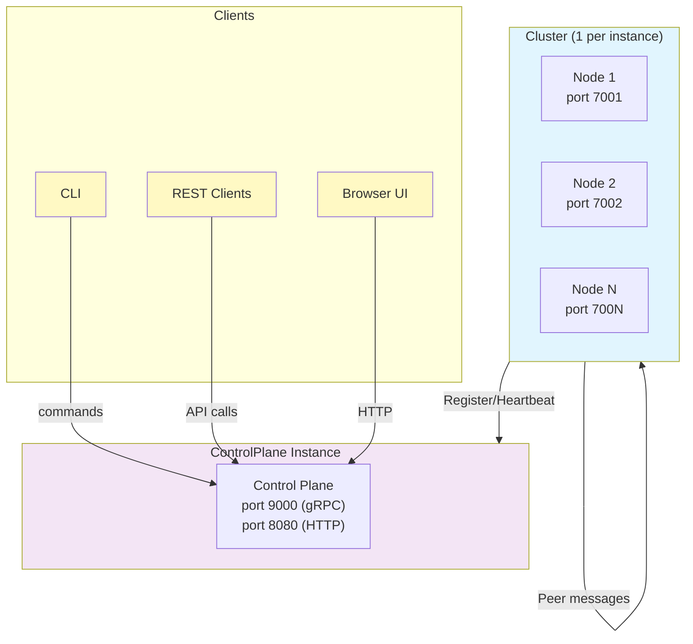

---

## Performance & Scalability Considerations

### Heartbeat Optimization
- Baseline protocol: 5-tick interval (configurable)
- Timeout detection: 20 ticks (configurable)
- Cleanup goroutine: 5-second interval

### Protocol Clock
- Logical ticks: 1-second intervals (per node)
- Prevents clock skew issues
- Enables deterministic replay

### State Access Patterns
- Manager: RWMutex for high read concurrency
- Actor: Buffered channel (default 100 items)
- Sessions: Per-peer connection pooling

---

## Testing & Observability

### Built-in Testing Hooks
- Protocol `State()` method for visibility
- Registration test file: [registration_test.go](../internal/controlplane/rpc/registration_test.go)
- Heartbeat timeout parameters configurable

### Monitoring Points
1. **Node Registration**: Service.RegisterNode() calls
2. **Heartbeat Updates**: Manager.OnHeartbeat() timestamps
3. **Peer Discovery**: GetPeers() responses
4. **Protocol Ticks**: Baseline tick counter
5. **Dead Node Removal**: Cleanup goroutine logs

