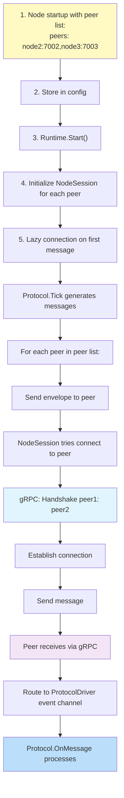

# FaultLab Data Flow & Interaction Patterns

Comprehensive guide to how data flows through the system and how components interact.

---

## Overview: The Big Picture

FaultLab operates with two primary data flows:

1. **Upstream (from nodes to control plane)**: Registration, heartbeats, status
2. **Downstream (from control plane to nodes)**: Commands, configuration, peer lists
3. **Peer-to-peer (node-to-node)**: Protocol messages, peer discovery

---

## Complete Request Lifecycle: Node Registration

This is the most complex flow as it involves all layers and components.

### User Initiates: "add-node cluster-1 node-1 127.0.0.1:7001"

#### Step 1: Presentation Layer Processing

```
┌─────────────────┐
│ User/CLI Input  │
│ "add-node ..."  │
└────────┬────────┘
         │
         ▼
┌──────────────────────────────┐
│ Parser.Parse()               │
│ • Validate arguments         │
│ • Create RegisterNodeCmd     │
└────────┬─────────────────────┘
         │
         ▼
┌──────────────────────────────────────────┐
│ Actor.Submit(RegisterNodeCmd)            │
│ • Serialize to JSON/struct               │
│ • Put in cmdCh buffer (buffered: 100)   │
│ • Non-blocking (returns immediately)    │
└────────┬─────────────────────────────────┘
         │
     Response waits...
```

#### Step 2: Orchestration Layer - Command Execution

Main Actor goroutine processes:

```
Actor.Run() goroutine (background)
    │
    ├─→ <-cmdCh
    │   (receive RegisterNodeCmd)
    │
    ├─→ Service.RegisterNode()
    │   │
    │   ├─→ Verify reachability
    │   │   NodeClient.Ping(host:port)
    │   │   └─→ gRPC: NodeService.Ping()
    │   │       └─→ Response: OK/FAIL (2s timeout)
    │   │
    │   ├─→ Add to Manager state
    │   │   Manager.AddNode()
    │   │   │
    │   │   └─→ RWMutex.Lock()
    │   │       • cluster.Nodes[id] = &Node{...}
    │   │       • RWMutex.Unlock()
    │   │
    │   └─→ Return result
    │
    └─→ replyCh <- result (non-blocking)
        (CLI/REST gets response)
```

#### Step 3: Transport Layer - RPC Verification

In parallel, the node continuously registers via heartbeat:

```
Node Startup:
  1. Runtime.Start()
  2. ProtocolDriver.Run() (goroutine)
  
ProtocolDriver Loop:
  ├─→ Initialize ticker (1s interval)
  │
  └─→ loop:
      ├─→ <-ticker.C (wait 1s)
      ├─→ protocol.Tick() → [Envelope]
      │
      ├─→ if tick % 5 == 0:
      │   └─→ Emit RegisterNode envelope
      │       │
      │       ├─→ To: "controlplane"
      │       ├─→ From: "node-1"
      │       ├─→ Kind: Control
      │       ├─→ Payload: {action: "register", ...}
      │       └─→ LogicalTick: 5, 10, 15, ...
      │
      ├─→ envelopes → Session.Send()
      │   │
      │   ├─→ lazydial controlplane (if needed)
      │   │
      │   └─→ gRPC: NodeService.SendEnvelope()
      │       │
      │       └─→ CP RPC Server receives
      │           │
      │           ├─→ Extract envelope
      │           ├─→ Route to Service
      │           │
      │           └─→ Service.ProcessEnvelope()
      │               │
      │               ├─→ type switch on Message.Kind
      │               ├─→ case "register":
      │               │   └─→ Update state
      │               │
      │               └─→ Return ack
```

### Complete Sequence Diagram

```mermaid
sequenceDiagram
    participant User
    participant CLI as CLI/Parser
    participant Actor as Actor Goroutine
    participant Service as Service Layer
    participant Manager as State Manager
    participant NodeClient as NodeClient RPC
    participant Node as Node Process
    participant NodeRuntime as Node Runtime
    participant ProtocolDriver as Protocol Driver
    participant Envelope as Sessions/Transport
    participant ControlPlaneRPC as CP RPC Server
    
    User->>CLI: add-node cluster-1 node-1 host:port
    CLI->>CLI: Parse arguments
    CLI->>Actor: Submit(RegisterNodeCmd)
    Note over Actor: Buffered in cmdCh
    
    Actor->>Service: RegisterNode()
    Service->>NodeClient: Ping(host:port)
    NodeClient->>Node: gRPC: Ping()
    Node->>Node: Respond OK
    NodeClient-->>Service: ✓
    
    Service->>Manager: AddNode()
    Manager->>Manager: RWMutex.Lock()
    Manager->>Manager: cluster.Nodes[id] = node
    Manager->>Manager: RWMutex.Unlock()
    Manager-->>Service: OK
    
    Service-->>Actor: Success
    
    par Async Registration (Node side)
        Node->>NodeRuntime: Start()
        NodeRuntime->>ProtocolDriver: Start()
        ProtocolDriver->>ProtocolDriver: Ticker loop
        
        loop Each tick
            ProtocolDriver->>ProtocolDriver: protocol.Tick()
            alt Every 5 ticks
                ProtocolDriver->>ProtocolDriver: Generate RegisterNode envelope
                ProtocolDriver->>Envelope: Send envelope
                Envelope->>ControlPlaneRPC: gRPC SendEnvelope()
                ControlPlaneRPC->>Service: Extract & route
                Service->>Manager: Update LastSeen
                Manager-->>Service: OK
                Service-->>ControlPlaneRPC: Response
                ControlPlaneRPC-->>Envelope: Ack
            end
        end
    end
    
    Actor-->>CLI: Response
    CLI-->>User: "Node registered"
```

---

## Flow: Heartbeat & Failure Detection

Heartbeats occur continuously after registration.

### Normal Operation (Node is Healthy)

```
Every 1 second (Node side):
┌──────────────────────────────────────────┐
│ ProtocolDriver.Run() - Tick Event        │
├──────────────────────────────────────────┤
│                                          │
│ tick count: 5, 10, 15, 20, ...          │
│                                          │
│ if tick % HEARTBEAT_INTERVAL == 0:      │
│   └─→ Generate heartbeat envelope       │
│       │                                  │
│       ├─→ From: node-id                 │
│       ├─→ To: "controlplane"            │
│       ├─→ Kind: Control                 │
│       ├─→ Action: "heartbeat"           │
│       ├─→ LogicalTick: N                │
│       │                                  │
│       └─→ Session.Send() to CP          │
│           │                              │
│           └─→ gRPC: SendEnvelope()      │
│               │                          │
│               └─→ CP receives            │
│                   │                      │
│                   └─→ Service receives   │
│                       │                  │
│                       └─→ Manager        │
│                           │              │
│                           ├─→ Find node  │
│                           ├─→ Timestamp: │
│                           │   LastSeen   │
│                           │   = now()    │
│                           │              │
│                           └─→ Success    │
│                                          │
└──────────────────────────────────────────┘
```

### Failure Detection: Node Stops Responding

```
Timeline:

t=0s:     Last heartbeat from node-1: OK
          LastSeen[node-1] = t=0

t=5s:     Expected heartbeat (not received)
          LastSeen[node-1] = 0 (stale)
          Cleanup checks: (now - LastSeen) = 5s
          ├─→ Not yet timeout (threshold: 20s)
          └─→ Still marked ALIVE

t=10s:    Still no heartbeat
          LastSeen[node-1] = 0 (very stale)
          Cleanup checks: (now - LastSeen) = 10s
          ├─→ Still < timeout
          └─→ Still marked ALIVE

t=20s:    Cleanup goroutine (5s interval)
          Check: (now - LastSeen) = 20s >= TIMEOUT
          ├─→ Delete node from cluster state
          ├─→ Log: "Node node-1 removed due to timeout"
          ├─→ If node recovers later:
          │   └─→ Will re-register as new node
          └─→ State becomes: DEAD/REMOVED

Alternative (Baseline Protocol detects first):
  Node 1 notices no response from Node 2
  ├─→ Mark state: Suspect
  ├─→ Increase probe frequency
  └─→ Eventually mark: Dead
      (then informs CP on heartbeat)
```

### Cleanup Goroutine (Every 5 seconds)

```go
// Pseudo-code
for range ticker.C {  // every 5 seconds
    clusters := manager.GetClusters()  // RLock
    
    for _, cluster := range clusters {
        for nodeID, node := range cluster.Nodes {
            timeSinceLastSeen := time.Since(node.LastSeen)
            
            if timeSinceLastSeen > HEARTBEAT_TIMEOUT {
                // Remove dead node
                manager.RemoveNode(cluster.ID, nodeID)
                log.Printf("Removed %s (timeout)", nodeID)
            }
        }
    }
}
```

---

## Flow: Peer-to-Peer Communication

How nodes discover and communicate with each other.

### Peer Discovery



### GetPeers Flow (Peer List Refresh)

```
Node periodic request to ControlPlane:
  
  ProtocolDriver.Tick()
  └─→ if tick % GET_PEERS_INTERVAL == 0:
      └─→ Send GetPeers envelope to CP
          │
          └─→ (or: Session.GetPeers RPC)
             │
             ├─→ gRPC to CP:GetPeers(cluster_id)
             │   │
             │   ├─→ CP Service.GetPeers()
             │   ├─→ Manager.GetCluster(cluster_id)
             │   ├─→ Return all node addresses
             │   │
             │   └─→ Response: [
             │       {id: node1, addr: host1, port: 7001},
             │       {id: node2, addr: host2, port: 7002},
             │       ...
             │     ]
             │
             └─→ Update local peer list
                 ├─→ NodeSession.UpdatePeers()
                 └─→ Close old peer connections if changed
```

---

## Flow: REST API Requests

How the web dashboard/external tools interact with the system.

```
Browser/Client sends:
  GET /api/clusters

  ├─→ REST Router matches /api/clusters
  │
  ├─→ Handler function:
  │   ├─→ List clusters from Manager
  │   └─→ Return JSON response
  │
  └─→ Response: {
      "clusters": [
        {
          "id": "cluster-1",
          "protocol": "baseline",
          "nodes": [
            {
              "id": "node-1",
              "address": "localhost",
              "port": 7001,
              "lastSeen": "2024-03-21T10:00:00Z"
            }
          ]
        }
      ]
    }

Browser/Client sends:
  POST /api/clusters/cluster-1/nodes
  Body: {
    "nodeId": "node-4",
    "address": "localhost",
    "port": 7004"
  }

  ├─→ REST Router matches route
  │
  ├─→ Handler:
  │   ├─→ Parse request body
  │   ├─→ Create AddNodeCmd
  │   ├─→ Actor.Submit(cmd)
  │   ├─→ Wait for response (replyCh)
  │   └─→ Return result as JSON
  │
  └─→ Response: 200 OK
      {"message": "Node added"}
```

---

## Message Types & Serialization

### Envelope Serialization Path

```
Message Generation (Node):
  └─→ Protocol.Tick()
      └─→ return Envelope{
            From: "node-1",
            To: "controlplane",
            Protocol: "baseline",
            Kind: MessageKind_CONTROL,
            LogicalTick: 5,
            Payload: <serialized protocol message>
          }

Serialization:
  └─→ protobuf.Marshal(envelope)
      └─→ []byte (binary)

Transport:
  └─→ gRPC NodeService.SendEnvelope()
      ├─→ Method parameter: EnvelopeRequest{Envelope: env}
      └─→ Protobuf automatically serialized

Reception:
  └─→ CP RPC Server receives
      ├─→ protobuf.Unmarshal()
      └─→ Reconstruct Envelope struct

Deserialization Path:
  └─→ switch envelope.Kind {
       case MessageKind_CONTROL:
         └─→ json.Unmarshal(envelope.Payload)
             └─→ Extract control message
       case MessageKind_PROTOCOL:
         └─→ Keep as bytes for protocol-specific handler
       }
```

### Protocol Message Encapsulation

```
BaselineProtocol Message -> Wrapped in Envelope

BaselineMembershipEvent:
  {
    "type": "heartbeat",
    "from": "node-1",
    "incarnation": 42,
    "timestamp": "2024-03-21T10:00:00Z"
  }

JSON encode -> []byte

Wrap in Envelope:
  Envelope{
    From: "node-1",
    To: "node-2",
    Protocol: "baseline",
    Payload: <JSON bytes above>,
    LogicalTick: 10,
    Kind: PROTOCOL
  }

Protobuf encode -> []byte

Send via gRPC -> Receiver
  
CP or Peer receives:
  Protobuf decode -> Envelope struct
  
  if envelope.To == "node-2":
    └─→ Route to node-2 session
    elif envelope.To == "controlplane":
      └─→ Route to service
  
  if envelope.Kind == PROTOCOL:
    └─→ Pass to Protocol.OnMessage()
        └─→ Protobuf strips, handlers json.Unmarshal(Payload)
```

---

## Concurrency & Synchronization

### Actor Pattern Serialization

```
Concurrent requesters:
    CLI 1 ─┐
    CLI 2 ─┼──→ Parser.Parse() ─┐
    REST  ─┤                    ├──→ Actor.cmdCh (buffered)
    gRPC  ─┼──→ Parser.Parse() ─┤
    ...   ─┘                    ┘

Actor.Run() processes sequentially:
    ├─→ <-cmdCh ← receive cmd1
    ├─→ execute
    ├─→ reply via replyCh
    │
    ├─→ <-cmdCh ← receive cmd2
    ├─→ execute
    ├─→ reply via replyCh
    │
    └─→ (loop continues)

Key guarantees:
  • Only ONE command executing at a time
  • State updates are atomic from command perspective
  • Prevents race conditions on Manager
```

### RWMutex Protection in Manager

```
Multiple Readers (concurrent GetCluster, GetClusters):
  Read Op 1: RLock() ─┐
  Read Op 2: RLock() ─┼──→ Read cluster state
  Read Op 3: RLock() ─┘
           ├─→ All concurrent
           └─→ No blocking

Write Op (AddNode):
  Write: Lock() ──→ Exclusive access
         ├─→ Read-ops BLOCK
         ├─→ Update state
         ├─→ Unlock()

Timeline:
  t=0: Read1.RLock()  ─ acquired
  t=1: Read2.RLock()  ─ acquired (concurrent)
  t=2: Write.Lock()   ─ WAITS for all readers
  t=3: Read1.RUnlock() ─ released
  t=4: Read2.RUnlock() ─ released
  t=5: Write.Lock()   ─ NOW ACQUIRES
  t=6: Write updates state
  t=7: Write.Unlock()
  t=8: Read3 can proceed
```

### Session State Tracking

```
NodeSession per-peer state:
  
  ┌──────────────────┐
  │ Peer: node-2     │
  ├──────────────────┤
  │ State: ALIVE     │  ← RWMutex protected
  │ Conn: *grpc      │
  │ LastProbed: t=N  │
  └──────────────────┘

State transitions:
  ALIVE ──no response──→ SUSPECT ──timeout──→ DEAD
          ↑                                    │
          └────────── recovery ───────────────┘

Protocol updates from remote node:
  OnMessage(Envelope) {
    if envelope.From == "node-2":
      └─→ session.UpdateState("node-2", ALIVE)
          └─→ RWMutex.Lock()
              └─→ peerStates["node-2"].State = ALIVE
  }
```

---

## Error Handling Flows

### Node Registration Failure

```
Scenario: Node fails to register (unreachable)

Service.RegisterNode():
  ├─→ NodeClient.Ping(host:port)
  │   ├─→ gRPC call with 2s timeout
  │   └─→ Context.DeadlineExceeded (or connection refused)
  │       └─→ return err
  │
  └─→ Return error to Actor
      └─→ replyCh <- error
          └─→ CLI prints: "Failed to register node: connection refused"
              
manager.AddNode() is SKIPPED:
  └─→ Node not added to state
  └─→ Can retry after fixing connectivity
```

### Heartbeat Timeout Handling

```
Node process crashes (no heartbeat):

Cleanup Goroutine (5s interval):
  ├─→ Query all clusters
  ├─→ For each node:
  │   ├─→ timeSinceLastSeen := time.Since(LastSeen)
  │   ├─→ if timeSinceLastSeen > TIMEOUT (e.g., 20s):
  │   │   ├─→ Manager.RemoveNode()
  │   │   ├─→ Log: "Node X removed (timeout)"
  │   │   └─→ Inform other nodes via GetPeers updates
  │   │
  │   └─→ else:
  │       └─→ Still waiting/suspect state
  │
  └─→ Continue loop

Peer nodes (if they have protocol failure detection):
  ├─→ Mark node as Suspect/Dead locally
  ├─→ Report to CP on next heartbeat
  └─→ CP confirms removal
```

### Network Partition Handling

```
Scenario: Node isolated (can't reach CP or peers)

Node behavior:
  ├─→ Continue running locally
  ├─→ Protocol continues operating
  ├─→ Tick loop unaffected
  ├─→ Heartbeats fail (Connection refused)
  └─→ Mark remote peers as Suspect/Dead

CP behavior:
  ├─→ Node heartbeat RPC times out
  ├─→ LastSeen timestamp never updates
  ├─→ After TIMEOUT, node removed from state
  ├─→ Event sent to WebUI: "Node X disconnected"
  └─→ UI updates dashboard

Recovery:
  ├─→ Network restored
  ├─→ Heartbeat RPC succeeds again
  ├─→ But node no longer in state!
  └─→ Node needs re-registration flow
      ├─→ Send RegisterNode envelope again
      └─→ CP adds back to cluster
```

---

## Complete Example: Adding 3 Nodes to a Cluster

```
User commands:
  1. new-cluster my-cluster baseline
  2. add-node my-cluster node-1 localhost:7001
  3. add-node my-cluster node-2 localhost:7002
  4. add-node my-cluster node-3 localhost:7003

Step-by-step execution:

COMMAND 1: new-cluster
  │
  ├─→ CLI: parse → CreateClusterCmd
  ├─→ Actor.Submit(cmd) → queue
  ├─→ Actor.Run() dequeue
  │   ├─→ Service.CreateCluster("my-cluster", "baseline")
  │   │   ├─→ Manager.CreateCluster(...)
  │   │   │   └─→ Clusters["my-cluster"] = {
  │   │   │        ID: "my-cluster",
  │   │   │        Protocol: "baseline",
  │   │   │        Nodes: {}
  │   │   │      }
  │   │   └─→ return OK
  │
  └─→ CLI: print "Cluster created"

COMMAND 2: add-node (node-1)
  │
  ├─→ CLI: parse → RegisterNodeCmd
  ├─→ Actor.Submit(cmd) → queue
  ├─→ Actor.Run() dequeue
  │   ├─→ Service.RegisterNode("my-cluster", "node-1", "localhost", 7001)
  │   │   ├─→ NodeClient.Ping("localhost:7001") → ✓
  │   │   ├─→ Manager.AddNode(...)
  │   │   │   └─→ cluster.Nodes["node-1"] = {ID, Addr, Port, LastSeen: now}
  │   │   │
  │   │   └─→ return OK
  │
  └─→ CLI: print "Node registered"

COMMANDS 3 & 4: Similar to command 2 (add-node node-2, add-node node-3)

Meanwhile, each node process (if running):
  
  Node 1:
    ├─→ Runtime.Start()
    ├─→ ProtocolDriver.Run() loop:
    │   ├─→ Tick 1: nothing
    │   ├─→ Tick 5: Send RegisterNode to CP
    │   ├─→ Tick 10: Send heartbeat
    │   ├─→ Tick 15: nothing
    │   ├─→ Tick 20: Send heartbeat (may trigger failure detection)
    │   │
    │   └─→ Generate peer envelopes:
    │       ├─→ Tick 3: peer probe node-2
    │       ├─→ Tick 7: peer probe node-3
    │       ├─→ Try handshake/connect
    │       ├─→ Exchange membership info
    │       └─→ Local consensus: who's alive?
    │
    └─→ All updates reflected in Protocol.State()
  
  Node 2 & 3: Similar execution
  
Network of 3 nodes eventually converges:
  ├─→ CP knows: node-1, node-2, node-3 all alive
  ├─→ Node-1 knows: node-2, node-3 (from CP or direct)
  ├─→ Node-2 knows: node-1, node-3
  ├─→ Node-3 knows: node-1, node-2
  └─→ System operational for testing
```

---

## Summary: Data Flow Patterns

| Pattern | Direction | Trigger | Transport | Latency |
|---------|-----------|---------|-----------|---------|
| **Registration** | Node → CP | On startup, tick 5 | gRPC envelope | ~100ms |
| **Heartbeat** | Node → CP | Periodic (5 ticks) | gRPC envelope | ~50ms |
| **GetPeers** | Node → CP | Periodic or on-demand | gRPC RPC | ~50ms |
| **Peer Probe** | Node ↔ Node | Protocol tick | gRPC envelope | ~20ms |
| **Command** | CLI/Web → CP | User action | gRPC/REST | <10ms |
| **State Query** | CLI/Web → CP | User request | REST API | ~5ms |
| **Failure Detection** | CP | Timeout check | Internal timer | 20-40s |

