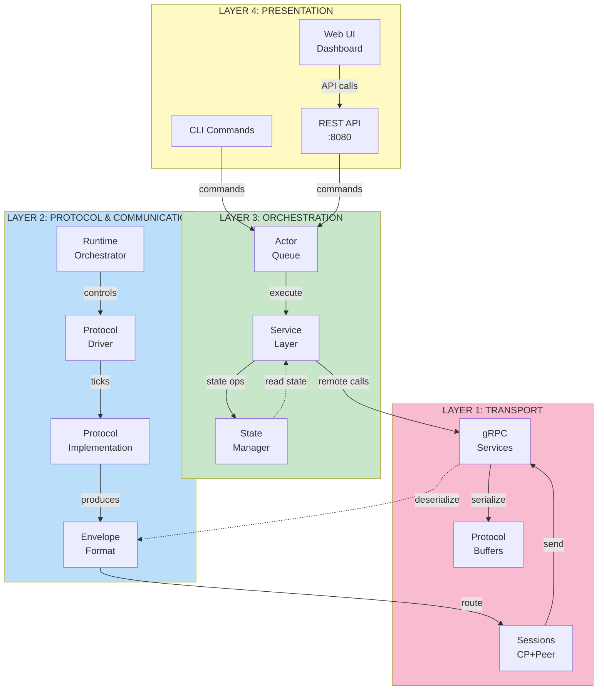

# FaultLab Layers & Components Reference

## Visual Layer Separation

This document provides quick visual reference for FaultLab's logical and physical layers.

---

## Layer 4: Presentation Layer

```
┌─────────────────────────────────────────────────────────────────────┐
│  PRESENTATION LAYER                                                 │
├─────────────────────────────────────────────────────────────────────┤
│                                                                       │
│  ┌──────────────┐      ┌──────────────┐      ┌──────────────┐      │
│  │   CLI Tool   │      │  REST API    │      │  Web UI      │      │
│  │              │      │  (Port 8080) │      │ (Next.js)    │      │
│  │ new-cluster  │      │              │      │              │      │
│  │ add-node     │  ◄──┤  GET/POST    │◄────►│  Dashboard   │      │
│  │ remove-node  │      │  /api/       │      │  Cluster viz │      │
│  │ list-nodes   │      │              │      │              │      │
│  └──────────────┘      └──────────────┘      └──────────────┘      │
│                                                                       │
│  ❯ External entry points for cluster operations                    │
│  ❯ Command parsing and validation                                  │
│  ❯ Human-readable output formatting                                │
│                                                                       │
└─────────────────────────────────────────────────────────────────────┘
                              │
                              │ Submit commands
                              ▼
```

---

## Layer 3: Orchestration & Coordination Layer

```
┌─────────────────────────────────────────────────────────────────────┐
│  ORCHESTRATION LAYER (ControlPlane)                                 │
│  ════════════════════════════════════════════════════════════════   │
│                                                                       │
│  ┌───────────────────────────────────────────────────────────────┐  │
│  │                    ACTOR (Command Queue)                      │  │
│  │  ┌─────────────────────────────────────────────────────────┐ │  │
│  │  │  Channel-based command processor (buffered: 100 items) │ │  │
│  │  │  • Serializes all commands                             │ │  │
│  │  │  • Prevents race conditions                            │ │  │
│  │  │  • Pattern: Single writer to shared state              │ │  │
│  │  └─────────────────────────────────────────────────────────┘ │  │
│  └────────┬──────────────────────────────────────────────────────┘  │
│           │ executes                                                 │
│  ┌────────▼──────────────────────────────────────────────────────┐  │
│  │              SERVICE LAYER (Business Logic)                   │  │
│  │  • RegisterNode()     - Verify & register nodes             │  │
│  │  • RemoveNode()       - Stop & cleanup nodes                │  │
│  │  • Heartbeat()        - Update LastSeen timestamp           │  │
│  │  • GetPeers()         - Return peer list per cluster        │  │
│  │  • CreateCluster()    - Initialize new cluster             │  │
│  │  • RemoveCluster()    - Cleanup cluster & nodes            │  │
│  └────────┬──────────────────────────────────────────────────────┘  │
│           │ reads/writes                                             │
│  ┌────────▼──────────────────────────────────────────────────────┐  │
│  │             MANAGER (State Storage)                           │  │
│  │  ┌─────────────────────────────────────────────────────────┐ │  │
│  │  │  Thread-safe state via RWMutex                          │ │  │
│  │  │  Clusters: map[string]*Cluster                          │ │  │
│  │  │  Nodes per cluster: map with ID, Address, Port, LastSeen│ │  │
│  │  └─────────────────────────────────────────────────────────┘ │  │
│  └──────────────────────────────────────────────────────────────┘  │
│           │                                                          │
│           ├─────────────────────────────┬────────────────────┐      │
│           │                             │                    │      │
│  ┌────────▼────────────┐   ┌────────────▼──────────┐  ┌─────▼──┐  │
│  │  CLEANUP GOROUTINE  │   │   RPC SERVER          │  │ NODE   │  │
│  │  (5s interval)      │   │   (port 9000)         │  │ CLIENT │  │
│  │  • Query Manager    │   │   • OrchestriatorSvc  │  │        │  │
│  │  • Check timeouts   │   │   • Routes to Service │  │ Remote │  │
│  │  • Remove dead      │   │                       │  │ calls  │  │
│  │    nodes            │   │                       │  │        │  │
│  └─────────────────────┘   └───────────────────────┘  └────────┘  │
│                                                                       │
│  ❯ Command serialization prevents race conditions                  │
│  ❯ Atomic state updates via Manager                                │
│  ❯ Background cleanup for failure detection                        │
│  ❯ Two RPC entry points: gRPC + REST                              │
│                                                                       │
└─────────────────────────────────────────────────────────────────────┘
                              │
                              │ gRPC requests
                              │ (RegisterNode, Heartbeat, GetPeers)
                              ▼
```

---

## Layer 2: Protocol & Communication Layer

```

### Gossip Implementation Boundaries

Within the gossip protocol implementation, concerns are split into dedicated files:

- internal/node/protocol/gossip/gossip.go
    - protocol core wiring, lifecycle, peer list setup, logger hooks
- internal/node/protocol/gossip/propagation.go
    - tick-driven digest emission, inbound message routing, digest/state propagation
- internal/node/protocol/gossip/conflict_resolution.go
    - vector-clock-first conflict resolution and state merge semantics
- internal/node/protocol/gossip/crud.go
    - local key-value APIs (put/get/delete) and write-side metadata updates
┌─────────────────────────────────────────────────────────────────────┐
│  PROTOCOL & COMMUNICATION LAYER (Node Processes)                   │
│                                                                       │
│  ┌────────────────────────────────────────────────────────────────┐ │
│  │                      RUNTIME ORCHESTRATOR                      │ │
│  │  • Loads protocol from registry                               │ │
│  │  • Initializes driver, sessions, gRPC server                 │ │
│  │  • Coordinates lifecycle: Start -> Run -> Stop               │ │
│  │  • Manages event channel for inbound messages                │ │
│  └────────────┬─────────────────────────────────────────────────┘ │
│               │ controls         drives                             │
│  ┌────────────▼──────────────┐  ┌──────────────────────┐          │
│  │   PROTOCOL DRIVER         │  │  PROTOCOL IMPL       │          │
│  │                           │  │  (BaselineProtocol)  │          │
│  │  • Tick loop (1s)         │═►│                      │          │
│  │  • Event queue listener   │  │  • Tick()            │          │
│  │  • Envelope dispatcher    │  │  • OnMessage()       │          │
│  │  • Session routing        │  │  • Start()           │          │
│  │                           │  │  • Stop()            │          │
│  │  Events:                  │  │  • State()           │          │
│  │  • EventTick (1s)         │  │                      │          │
│  │  • EventMessage (peers)   │  │  Baseline features:  │          │
│  └────────────┬──────────────┘  │  • Gossip heartbeat  │          │
│               │                 │  • Membership view   │          │
│               └────────────────►│  • Failure detection │          │
│                                 │  • Suspect/Dead      │          │
│                                 │    states            │          │
│                                 └──────────────────────┘          │
│               │                                                    │
│               │ produces envelopes                                 │
│               ▼                                                    │
│  ┌────────────────────────────────────────────────────────────────┐ │
│  │             ENVELOPE DISPATCH & DELIVERY                       │ │
│  │                                                                | │
│  │  Envelope format:                                             │ │
│  │  ┌────────────────────────────────────────────────────────┐  │ │
│  │  │ From: sender_node_id                                  │  │ │
│  │  │ To: receiver_node_id (or "controlplane")             │  │ │
│  │  │ Protocol: <protocol_name>                            │  │ │
│  │  │ Kind: MessageKind (Protocol/Control/Data)            │  │ │
│  │  │ LogicalTick: uint64                                  │  │ │
│  │  │ Payload: []byte (serialized protocol msg)            │  │ │
│  │  └────────────────────────────────────────────────────────┘  │ │
│  │                                                                │ │
│  └────────────────────────────────────────────────────────────────┘ │
│                                                                       │
│  ❯ Protocol-agnostic runtime enables pluggable algorithms          │
│  ❯ Logical clock for deterministic execution                        │
│  ❯ Event-driven message processing                                  │
│  ❯ Extensible protocol interface                                    │
│                                                                       │
└─────────────────────────────────────────────────────────────────────┘
                              │
                              │ Protocol messages wrapped in envelopes
                              ▼
```

---

## Layer 1: Transport & Infrastructure Layer

```
┌─────────────────────────────────────────────────────────────────────┐
│  TRANSPORT & INFRASTRUCTURE LAYER                                   │
│                                                                       │
│  ┌───────────────────────────────────────────────────────────────┐  │
│  │                    SESSION MANAGEMENT                         │  │
│  │                                                               │  │
│  │  ┌─────────────────────────────┐   ┌───────────────────────┐ │  │
│  │  │  ControlPlaneSession        │   │  NodeSession(s)       │ │  │
│  │  │  (lazy dial to CP)          │   │  (peer connections)   │ │  │
│  │  │                             │   │                       │ │  │
│  │  │  • RegisterNode RPC         │   │  • Per-peer state:    │ │  │
│  │  │  • Heartbeat RPC            │   │    Alive/Suspect/Dead │ │  │
│  │  │  • GetPeers RPC             │   │  • Lazy connection    │ │  │
│  │  │  • Connection pooling       │   │  • Handshake protocol │ │  │
│  │  │  • Keep-alive (TCP)         │   │  • Connection cache   │ │  │
│  │  │                             │   │  • Health tracking    │ │  │
│  │  └─────────────────────────────┘   └───────────────────────┘ │  │
│  │                                                               │  │
│  └───────────────────────────────────────────────────────────────┘  │
│                    │                     │                         │  │
│                    │ RPC calls           │ RPC calls (SendEnvelope)│  │
│                    ▼                     ▼                         │  │
│  ┌────────────────────────────────────────────────────────────────┐  │
│  │              gRPC TRANSPORT LAYER                              │  │
│  │                                                                 │  │
│  │  ┌─────────────────────────────┐   ┌────────────────────────┐  │  │
│  │  │ OrchestratorService (CP)    │   │ NodeService (Node)     │  │  │
│  │  │ (port 9000)                 │   │ (port 7001+)           │  │  │
│  │  │                             │   │                        │  │  │
│  │  │ RPC methods:                │   │ RPC methods:           │  │  │
│  │  │ • RegisterNode              │   │ • Ping                 │  │  │
│  │  │ • Heartbeat                 │   │ • Handshake            │  │  │
│  │  │ • GetPeers                  │   │ • SendEnvelope         │  │  │
│  │  │                             │   │ • StopNode             │  │  │
│  │  └─────────────────────────────┘   └────────────────────────┘  │  │
│  │                                                                 │  │
│  │  Protobuf definitions:                                         │  │
│  │  • cluster.proto (OrchestratorService)                         │  │
│  │  • node.proto (NodeService)                                    │  │
│  │                                                                 │  │
│  └────────────────────────────────────────────────────────────────┘  │
│                                                                       │
│  ┌────────────────────────────────────────────────────────────────┐  │
│  │  MESSAGE FORMAT: Envelope (Protocol-agnostic wrapper)         │  │
│  │                                                               │  │
│  │  Binary serialization: Protocol Buffers                      │  │
│  │  Transport: gRPC (HTTP/2 over TCP)                           │  │
│  │  Port allocation:                                            │  │
│  │    • ControlPlane: 9000 (gRPC), 8080 (REST)                 │  │
│  │    • Nodes: 7001, 7002, ... (configurable)                 │  │
│  │                                                               │  │
│  └────────────────────────────────────────────────────────────────┘  │
│                                                                       │
│  ❯ gRPC for type-safe, efficient RPC                               │
│  ❯ Protocol Buffers for cross-language compatibility               │
│  ❯ Session pooling reduces connection overhead                     │
│  ❯ Lazy connections for sparse clusters                            │
│  ❯ Generic Envelope allows protocol extensibility                  │
│                                                                       │
└─────────────────────────────────────────────────────────────────────┘
           │                                      │
           │ TCP/IP Network                      │
           ▼                                      ▼
      ControlPlane                            Peer Nodes
```

---

## Complete Stack Diagram (All Layers)



---

## Component Communication Map

### Synchronous (Request-Response)

```
┌────────────┐                           ┌──────────────┐
│ ControlPl. │ RegisterNode RPC          │   Node 1     │
│  Service   │◄──────────Register────────►  Session CP  │
└────────────┘          Response         └──────────────┘
   │ │ │
   │ │ └─→ Verify via Ping (2s timeout)
   │ │
   │ └────→ GetPeers (for node discovery)
   │
   └─────→ Heartbeat (periodic updates)
```

### Asynchronous (Event-Driven)

```
Node 1                          Node 2
Protocol.Tick()
  │
  └──> Generate Envelope
       │
       └──> NodeSession.Send(peer2)
            │
            └──> gRPC: SendEnvelope()
                 │
                 └──> (async) gRPC Server
                      │
                      └──> Event Channel
                           │
                           └──> ProtocolDriver
                                │
                                └──> Protocol.OnMessage()
```

---

## Data Flow Patterns

### Pattern 1: Registration Flow (Sync)

```
1. User/CLI → new-cluster
2. → Actor.Submit(CreateClusterCmd)
3. → Actor.Run() processes
4. → Service.CreateCluster()
5. → Manager.CreateCluster()
6. → Reply ← CLI
```

### Pattern 2: Heartbeat Flow (Async-Periodic)

```
1. Node ProtocolDriver: Every 1s tick
2. → Protocol.Tick() (every 5 ticks)
3. → Emit Envelope(Heartbeat)
4. → NodeSession.Send()
5. → gRPC: SendEnvelope() (to CP)
6. → CP RPC Server routes
7. → Service.Heartbeat()
8. → Manager.OnHeartbeat() (update LastSeen)
```

### Pattern 3: Peer Message Flow (Async-On-Demand)

```
1. Node 1 Protocol.Tick()
2. → Generate peer envelope
3. → NodeSession.Send(peer2)
4. → gRPC to peer2:7002
5. → NodeService.SendEnvelope()
6. → Event channel
7. → ProtocolDriver
8. → Protocol.OnMessage()
9. → Process locally
```

---

## Key Concepts at Each Layer

| Layer | Key Concepts | Thread Model | RPC Mechanism |
|-------|--------------|--------------|---------------|
| **4: Presentation** | Commands, APIs, UI | Single-threaded CLI | HTTP/gRPC input |
| **3: Orchestration** | Actor pattern, State consistency | Channel-based serialization | Actor queue |
| **2: Protocol** | Ticks, Events, Envelopes | Multi-goroutine (driver + server) | Event channel |
| **1: Transport** | Sessions, RPC, Serialization | Lock-based (RWMutex) | gRPC + Protobuf |

---

## Deployment Architecture

```
┌─────────────────────────────────────────────────┐
│  Single Machine - Multiple Processes            │
├─────────────────────────────────────────────────┤
│                                                 │
│  ┌────────────────────────────────────────────┐│
│  │  ControlPlane (1 instance)                 ││
│  │  • Port 9000 (gRPC)                        ││
│  │  • Port 8080 (REST)                        ││
│  │  └─> Cluster state                         ││
│  └────────────────────────────────────────────┘│
│            ▲                    ▲               │
│            │                    │               │
│  ┌─────────┴────────┐  ┌────────┴─────────┐   │
│  │   Node 1         │  │   Node 2         │   │
│  │  Port 7001       │  │  Port 7002       │   │
│  │  ┌────────────┐  │  │  ┌────────────┐  │   │
│  │  │ Runtime    │  │  │  │ Runtime    │  │   │
│  │  │ Protocol   │  │  │  │ Protocol   │  │   │
│  │  │ Driver     │  │  │  │ Driver     │  │   │
│  │  └────────────┘  │  │  └────────────┘  │   │
│  │        ◄────────────────►              │   │
│  │     (peer messages)                    │   │
│  └──────────────────────┬─────────────────┘   │
│                         │ (heartbeats,        │
│                         │  registration)      │
│                         ▼                      │
│  ┌─────────────────────────────────────────┐  │
│  │  Frontend (Web UI)                      │  │
│  │  Browser at localhost:3000              │  │
│  │  ◄──────────► REST API :8080           │  │
│  └─────────────────────────────────────────┘  │
│                                                 │
└─────────────────────────────────────────────────┘
```

---

## Performance Characteristics

### Latency

| Operation | Latency | Notes |
|-----------|---------|-------|
| Command execution | <10ms | Actor queue processing |
| Node registration | ~100ms | Includes ping verification |
| Heartbeat round-trip | ~50ms | gRPC + protobuf |
| Peer message delivery | ~20ms | Direct gRPC between nodes |
| Failure detection | 20-40 ticks | ~20-40 seconds (configurable) |

### Throughput

| Operation | Rate | Bottleneck |
|-----------|------|-----------|
| Commands | 100-1000 ops/s | Actor queue size |
| Heartbeats | Linear with cluster size | Cleanup goroutine (5s interval) |
| Peer messages | Protocol-dependent | Network bandwidth |

---

## Quick Reference: File Locations

```
internal/
├── controlplane/          ← Layer 3 (Orchestration)
│   ├── actor.go           ← Command queue
│   ├── service/service.go ← Business logic
│   ├── rpc/server.go      ← gRPC endpoint
│   └── rest/server.go     ← REST endpoint
├── cluster/
│   ├── config.go          ← Data models
│   └── manager/           ← State mgmt
│       ├── manager.go
│       └── heartbeat_manager.go
├── node/                  ← Layer 2 (Protocol)
│   ├── runtime/
│   │   ├── runtime.go     ← Orchestrator
│   │   ├── protocol_loop.go ← Driver
│   │   └── event.go
│   ├── session/           ← Layer 1 (Sessions)
│   │   ├── controlplane.go
│   │   └── node.go
│   ├── server.go          ← gRPC server
│   └── protocol/          ← Protocol interface
│       ├── protocol.go
│       ├── envelope.go
│       ├── registry.go
│       └── baseline/
│           └── baseline.go
└── protocol/              ← Layer 1 (Transport)
    ├── cluster.proto      ← OrchestratorService
    └── node.proto         ← NodeService
```

