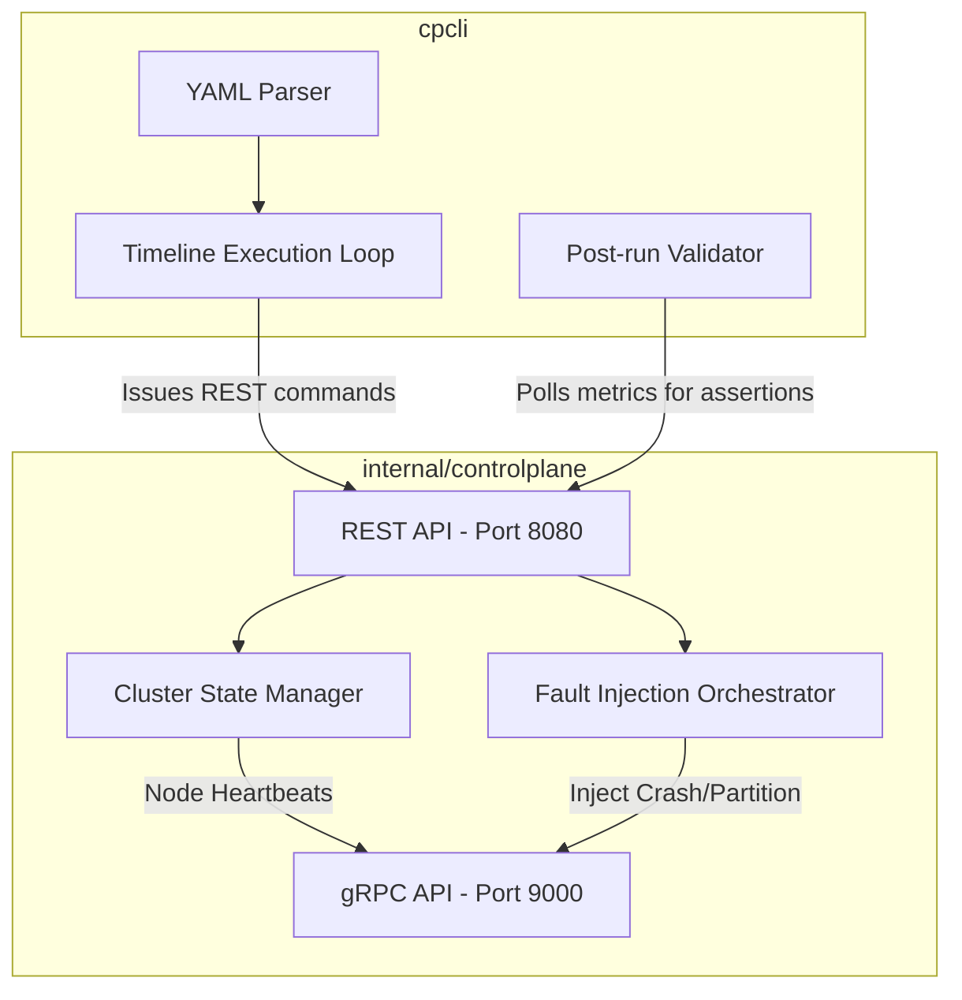

# Subsystem: Control Plane & Hypothesis Engine

The Control Plane serves as the operational brain of the FaultLab testing environment. It oversees cluster lifecycles, manages node registrations, and orchestrates the automated execution of chaos hypotheses.

## Architecture

## Core Responsibilities

1. **Cluster Management (`ClusterManager`)**:
   - Accepts gRPC registration from new database nodes.
   - Tracks node heartbeats. If a node fails to send a heartbeat within the configured timeout (`-heartbeat-timeout`), the Control Plane marks it as dead.

2. **Fault Injection (`FaultOrchestrator`)**:
   - Exposes HTTP endpoints allowing tools (like `cpcli`) to send fault configuration requests.
   - Pushes `SetFaultConfig` gRPC commands down to specific nodes, instructing them to isolate themselves, drop packets, or shut down entirely.

3. **Hypothesis Engine (`cpcli`)**:
   - Parses deterministic test scenarios (`.yaml` format).
   - Translates `timeline.at` values into precise `time.Sleep` offsets.
   - Triggers `action: partition`, `action: heal_partition`, or `action: write` by sending targeted REST calls to the Control Plane.
   - Upon test completion, reads the Control Plane's metrics snapshot to assert convergence correctness.
