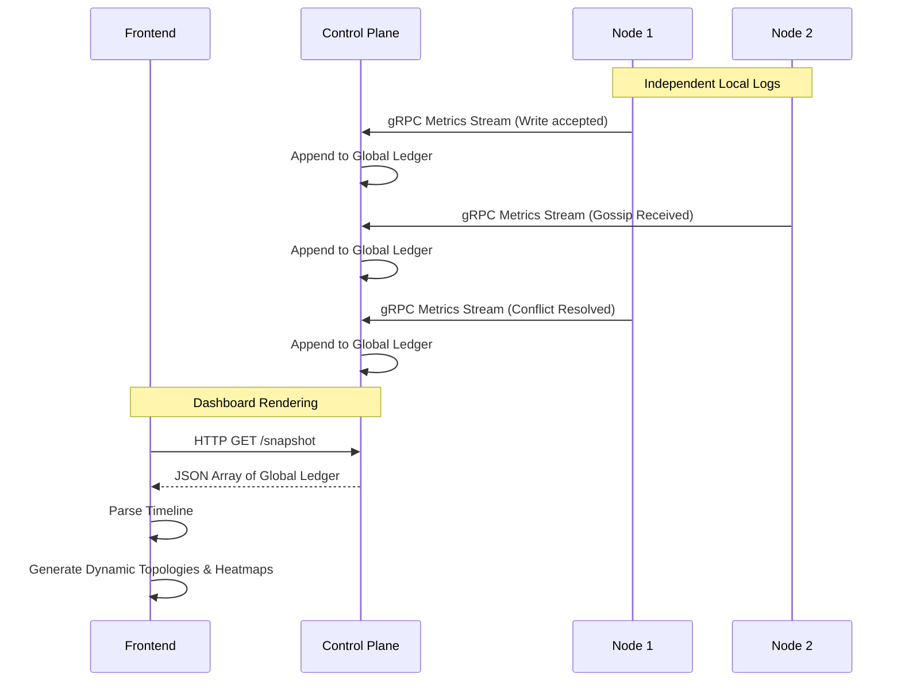

# Subsystem: Logging, Metrics, and Observability Ledger

The FaultLab Observability subsystem is responsible for aggregating distributed events into a single, ordered causal timeline, enabling deep post-mortem analysis and visualization.

## Architecture

## Core Components

1. **Metrics Publisher (Node-side)**:
   - Resides in `internal/metrics/`.
   - Every state change on a node (accepting a write, receiving gossip, resolving a conflict, connecting/disconnecting) fires a metric event.
   - Pushes a continuous gRPC stream of `TimelineEvent`s up to the Control Plane.

2. **Global Event Ledger (Control Plane-side)**:
   - Resides in `internal/controlplane/actor.go`.
   - Acts as the central chronological source of truth.
   - Automatically injects "SYSTEM" level events into the ledger when faults (like Partitions or Node Crashes) are requested by the Hypothesis Engine.
   - Preserves timestamps in microseconds to resolve near-simultaneous distributed events.

3. **Observability Exporter (Frontend API)**:
   - Resides in `internal/controlplane/rest/server.go`.
   - The `/api/clusters/{id}/snapshot` HTTP endpoint returns the complete chronological ledger array.
   - Designed to support high-fidelity post-mortem investigations by the React dashboard (Heatmaps, Waterfall charts, etc.).
