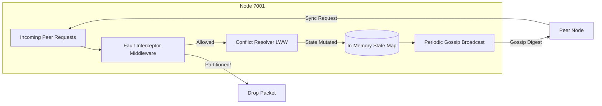

# Subsystem: Database Nodes & Gossip Protocol

The Nodes act as the stateful worker engines of the system. Each node operates completely independently, communicating with its peers solely through decentralized gossip protocols to replicate key-value data.

## Architecture

## Core Components

1. **Epidemic Gossip (`internal/node/protocol/gossip/`)**:
   - Instead of a central master dictating state, nodes randomly select a subset of peers and share their known state digest (keys + timestamps).
   - If a peer realizes it has older data, it requests a synchronization payload.
   - Enables eventual consistency even if a massive network partition occurs.

2. **Last-Write-Wins (LWW) Resolution**:
   - When a node receives conflicting values for the same key, it inspects the logical timestamp and origin node ID.
   - The value with the highest logical timestamp is chosen.
   - Resolves concurrent isolated writes when network partitions heal.

3. **Fault Interceptor (`internal/fault/`)**:
   - Wraps the incoming and outgoing gRPC networking layer.
   - **Drop Rate**: Randomly drops `x%` of packets to simulate flaky connections.
   - **Delay**: Artificially sleeps for `x` milliseconds before processing an incoming message.
   - **Partitioning**: Completely blacklists specific node IDs from communicating, perfectly simulating a split-brain environment.
